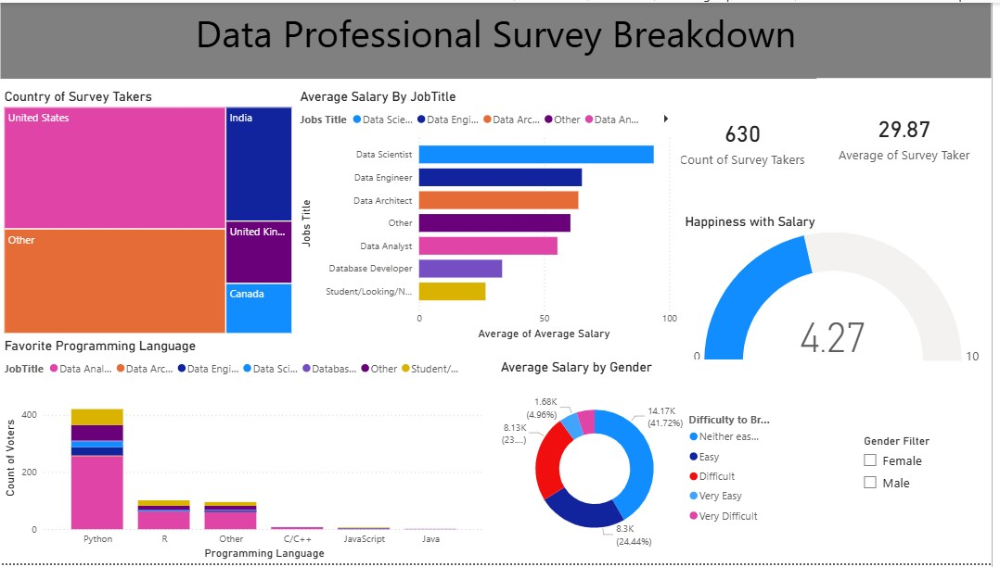

# 📊 Data Professional Survey Dashboard

## 🚀 Overview
This project showcases an interactive **Power BI Dashboard** created using a real-world survey dataset of data professionals from different countries.  

The dashboard transforms raw survey data into meaningful insights through visualizations, helping users understand trends in salaries, programming languages, job roles, and employee satisfaction.  

It is one of my beginner-level data analytics projects and demonstrates my skills in **Power BI, data cleaning, data visualization, and dashboard design**.

---

## 🎯 Objectives
- Analyze salary trends across different data roles  
- Identify the most popular programming languages  
- Compare survey participation by country  
- Measure happiness with salary  
- Understand career difficulty levels in the data field  
- Explore gender-based salary insights  

---

## 📌 Dashboard Features

### 🌍 Country of Survey Takers
Shows the number of survey participants from different countries such as:
- United States  
- India  
- United Kingdom  
- Canada  
- Others  

### 💼 Average Salary by Job Title
Compares salaries of different data-related roles:
- Data Scientist  
- Data Engineer  
- Data Architect  
- Data Analyst  
- Database Developer  
- Students / Job Seekers  

### 💻 Favorite Programming Language
Displays the most preferred programming languages:
- Python  
- R  
- JavaScript  
- Java  
- C/C++  

### 😊 Happiness with Salary
Gauge chart showing satisfaction level with salary.

### ⚡ Difficulty to Break into Data
Pie chart representing how difficult professionals feel it is to enter the data field.

### 👨‍💼 Gender Filter
Interactive filter to analyze dashboard insights by gender.

---

## 🛠️ Tools & Technologies Used
- **Power BI Desktop**  
- **Excel Dataset (.xlsx)**  
- Data Cleaning  
- Data Modeling  
- Data Visualization  

---

## 📷 Dashboard Preview

---

## 📂 Project Files
- `Power BI - Final Project.xlsx` → Source dataset  
- `Data Professional Survey Dashboard.pbix` → Power BI file *(if uploaded)*  
- `First_Project.jpg` → Dashboard screenshot  

---

## 📈 Key Insights
- Data Scientists have the highest average salary among surveyed roles.  
- Python is the most preferred programming language.  
- Most participants are from the United States.  
- Overall salary happiness score is moderate.  
- Entering the data field is considered challenging by many respondents.  

---

## 🌟 What I Learned
Through this project, I learned:
- How to import and clean data in Power BI  
- Building interactive dashboards  
- Creating charts, KPIs, slicers, and filters  
- Extracting insights from raw datasets  
- Improving dashboard storytelling skills  

---

## 🔮 Future Improvements
- Add more advanced DAX calculations  
- Include predictive analytics visuals  
- Enhance UI design and theme  
- Publish dashboard online using Power BI Service  

---

## 👨‍💻 Author
**Rishabh Yadav**  
Aspiring Data Analyst | Power BI Learner | Entrepreneur  

📌 If you like this project, don't forget to ⭐ the repository!
